# android-OpenCV-SIFT
此範例透過 Android Native C++ 與 OpenCV 4.5.1 來執行電腦視覺專案。將會以 2020 年開源的 SIFT 演算法來計算圖片的特徵點。

## Step 1: 建立專案
開啟 Android Studio 建立一個以 Android Native C++ 為基底的專案。這一個選項他會建構一個 C/C++ 環境能夠透過 JNI (Java Native Interface) ，執行呼叫 C/C++ 語言的程式。

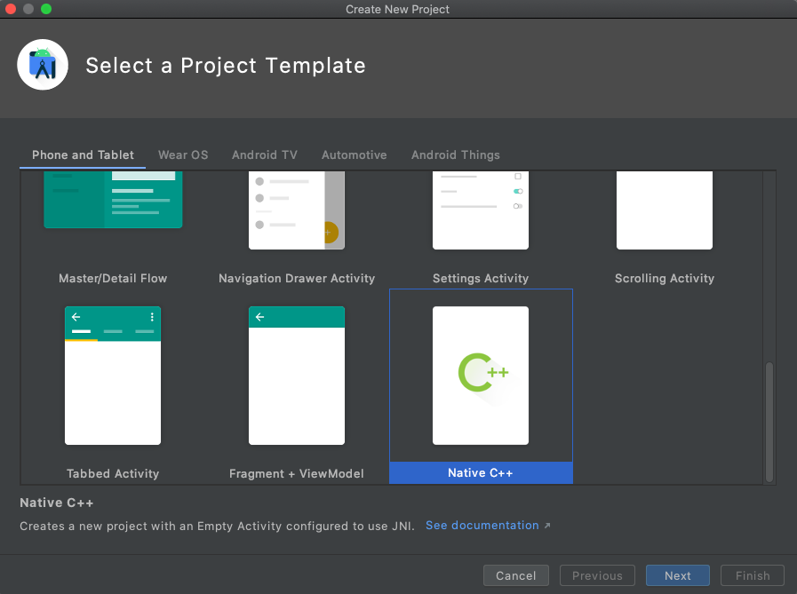
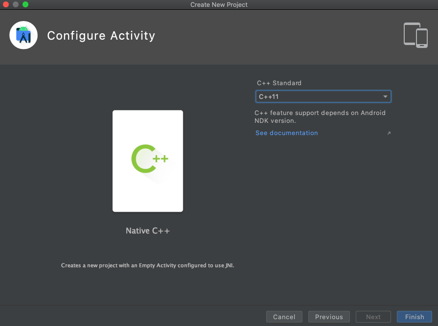

建立完成後我們可以將專案視窗改成 `Project` 的資料夾模式，以利後續操作。

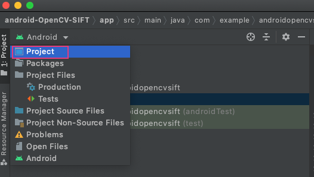

## Step 2: 下載 OpenCV SDK
進入 OpenCV [官網](https://opencv.org/releases/) 挑選版號本(此範例採用4.5.1)並下載 Android 版本。下載後進入 SDK 資料夾，找到 java 資料夾並將他改名成 `openCVLibrary451` (此動作是為了等等要匯入此資料夾，先將它命名完成)。說個題外話之前的版本匯入 java 資料夾時會系統自動將他改名成相對應版本號的 library，個人覺得是 Bug 因此要手動處理名稱較麻煩(未來應該會解決)。

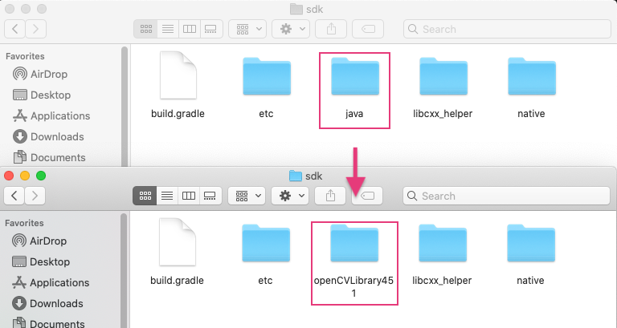

## Step 3: 匯入 OpenCV SDK
點選上方工具列 File > New > Import Module。選擇剛剛第二步驟已經改名後的 `openCVLibrary451` 資料夾，完成後點選下一步並按完成匯入。

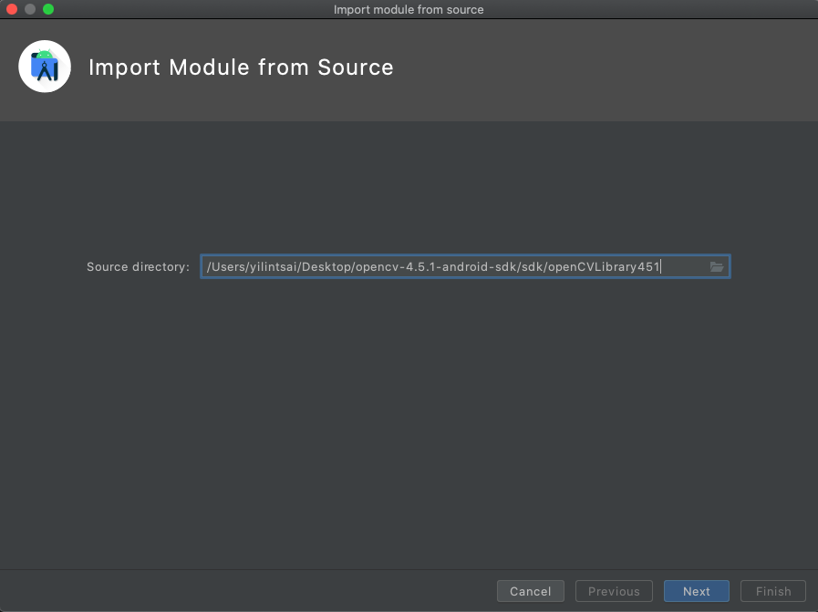

匯入完成後可以看到 `openCVLibrary451` 在主目錄資料夾中，但是我們匯入的是要當作 module 使用並非 APP(下圖紅框)。因此我們要手動將它改成 library。(之前版本沒這問題4.3版本以後的問題有點多，但是為了展示最新版的SIFT API不得不使用)

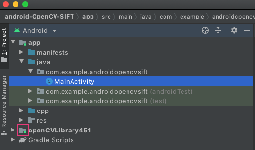

修改 `openCVLibrary451` 的 build.gradle。把 OpenCV 從 application 改成 library 才能 import。修改 `apply plugin: 'com.android.application'` ，把 `application` 改成 `library`。並且將 applicationId 刪除掉。刪除以下:

```
defaultConfig {
    applicationId "org.opencv
}
```

修改後build.gradle(openCVLibrary451)如下:

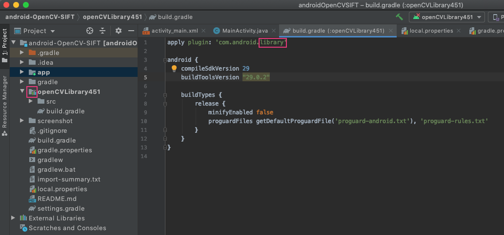

## Step 4: dependencies加入OpenCV
點選File > Project Structure ，進入 Project Structure 畫面，點選左邊 Dependencies 選項，Modules 選 app ，點 [+] 選 `3 Module Dependency`，如下圖:

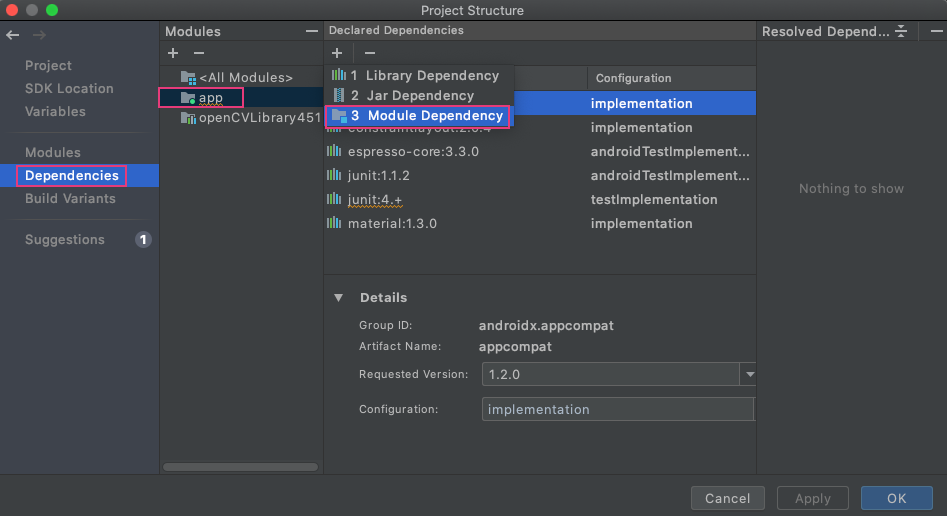

點選剛剛稍早匯入的 `openCVLibrary451` module。點選 ok 後我們的專案就能成功使用 OpenCV 的函式庫囉。

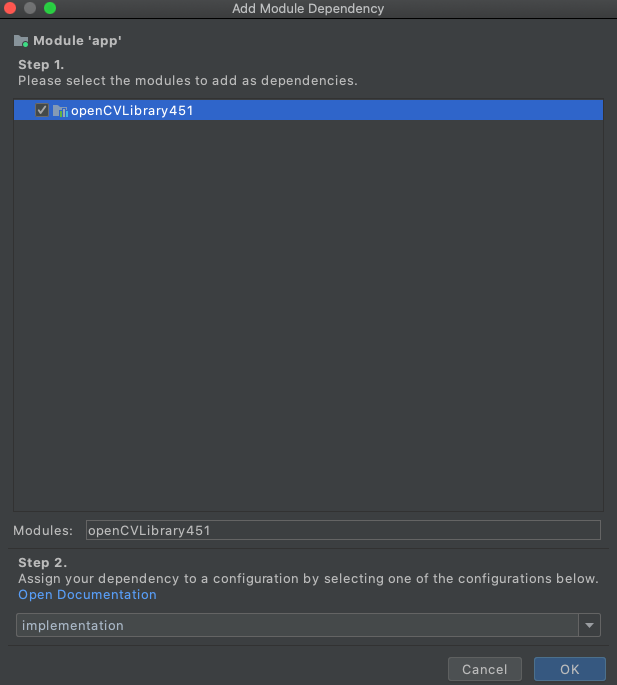

我們可以開啟 build.gradle(app) 來查看 `openCVLibrary451` 是否已經成功被匯入。

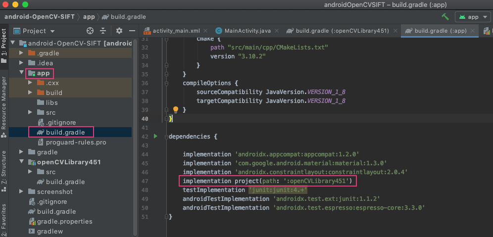

## Step 5: 新增Native Libraries
將 `\OpenCV-android-sdk\sdk\native\libs`中的 `armeabi-v7a` 與 `x86` 檔案複製到 `\app\libs` 下，常見通常都需要這兩個CPU類型。前者是現在手機目前主流架構 arm7，後者是給開發者在模擬器上除錯執行用。直到目前為止，Android 共有7種不同的 cpu 分別為 ARMv5，ARMv7（從2010年起）x86（從2011年起）MIPS（從2012年起）ARMv8，MIPS64 和 x86_64（從2014年起）。為了支援這些 cup 我們就需要包相對應的 so 檔進 apk 裡。

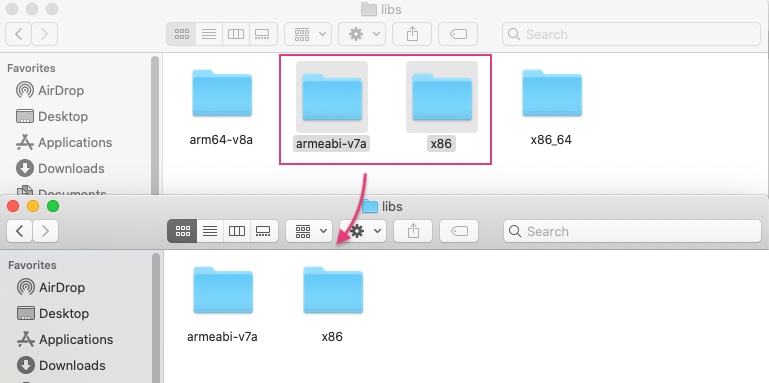

接下來指定 `jniLibs` 路徑，開啟 app 的 build.gradle，增加:

```
sourceSets{
    main {
        jniLibs.srcDirs = ['libs']
    }
}
```

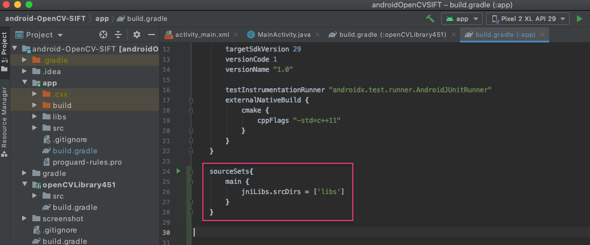

## !!!

如果編譯執行後發生以下錯誤訊息:

> java.lang.UnsatisfiedLinkError: dlopen failed: library "libc++_shared.so" not found

解決方式: 在build.gradle(app) 的 cmake 增加:

```
cmake {
    arguments "-DANDROID_STL=c++_shared"
}
```

## 完整MainActivity.java

```java
import androidx.appcompat.app.AppCompatActivity;

import android.graphics.Bitmap;
import android.graphics.BitmapFactory;
import android.os.Bundle;
import android.widget.ImageView;
import android.widget.TextView;

import org.opencv.android.Utils;
import org.opencv.core.Mat;
import org.opencv.core.MatOfKeyPoint;
import org.opencv.features2d.Features2d;
import org.opencv.features2d.SIFT;
import org.opencv.imgproc.Imgproc;

public class MainActivity extends AppCompatActivity {

    // Used to load the 'native-lib' library on application startup.
    static {
        System.loadLibrary("native-lib");
        System.loadLibrary("opencv_java4");
    }

    private ImageView imageView;
    private Bitmap inputImage, targetImage; // make bitmap from image resource
    private SIFT sift = SIFT.create();

    @Override
    protected void onCreate(Bundle savedInstanceState) {
        super.onCreate(savedInstanceState);
        setContentView(R.layout.activity_main);

        // Example of a call to a native method
        TextView tv = findViewById(R.id.sample_text);
        tv.setText(stringFromJNI());

        inputImage = BitmapFactory.decodeResource(getResources(), R.drawable.coca_cola);
        imageView = (ImageView) this.findViewById(R.id.imageView);
        sift();
    }
    public void sift() {
        Mat rgba = new Mat();
        Utils.bitmapToMat(inputImage, rgba);
        MatOfKeyPoint keyPoints = new MatOfKeyPoint();
        Imgproc.cvtColor(rgba, rgba, Imgproc.COLOR_RGBA2GRAY);
        sift.detect(rgba, keyPoints);
        Features2d.drawKeypoints(rgba, keyPoints, rgba);
        Utils.matToBitmap(rgba, inputImage);
        imageView.setImageBitmap(inputImage);
    }

    /**
     * A native method that is implemented by the 'native-lib' native library,
     * which is packaged with this application.
     */
    public native String stringFromJNI();
}
```